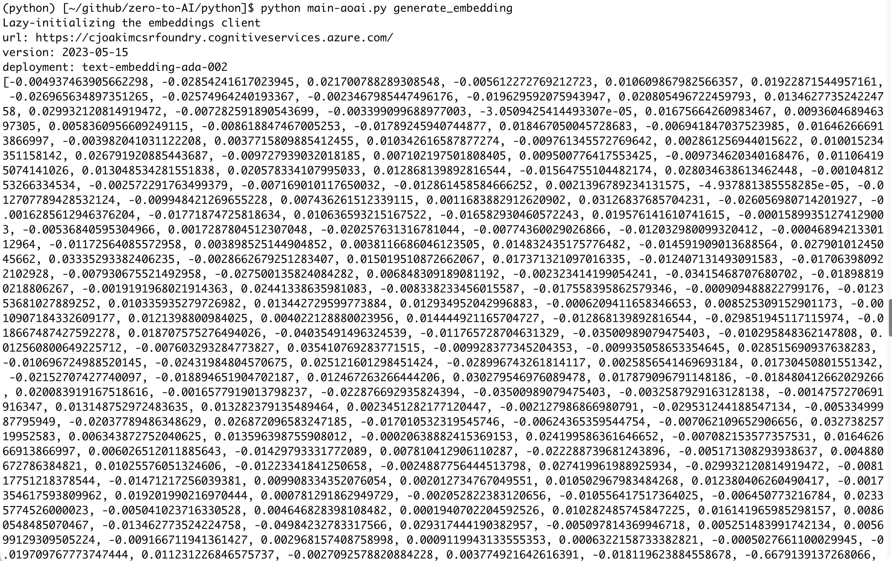

# Part 2, Session 11 - Azure OpenAI SDK

<br><br>

This session will mostly involve reviewing code samples in this repository.
and demonstrations of this code in invoking the Azure OpenAI.

We'll look closely at python module **python/main-aoai.py** in this repository.

This program will use class **AOAIUtil** in module **python/src/ai/aoai_util.py**
to generate completions and embeddings.

<br><br>

## Class AOAIUtil

This **custom and reusablepython class** encapsulates the logic for generating
completions and embeddings using the Azure OpenAI SDK.

It implements these two method "signatures":

```
async def generate_completion(self, system_context: str, user_prompt: str) -> object | None:

async def generate_embeddings(self, text: str) -> list[float] | None:
```

## Generating Completions

Submit a prompt, and get the response back from the LLM - that's called a **Completion**.


### Example 

#### The python command-line 

```
python main-aoai.py generate_completion
```

The prompt is "hard-coded" in the example program.

#### The code in main-aoai.py

```
async def generate_completion():
    ai_util = AOAIUtil()  # See module python/src/ai/aoai_util.py in this repository
    system_context = "You are a helpful assistant who knows Major League Baseball."
    user_prompt = "What uniform number did Mickey Mantle wear?"
    completion = await ai_util.generate_completion(system_context, user_prompt)
    print(completion)
```

#### The output from python main-aoai.py generate_completion

This output is intentionally verbose, to show the details of the completion.

```
Lazy-initializing the completions client
url: https://cjoakimcsrfoundry.cognitiveservices.azure.com/
version: 2024-12-01-preview
deployment: gpt-5-mini
=== completion type ===
<class 'openai.types.chat.chat_completion.ChatCompletion'>
=== message ===
ChatCompletionMessage(content='Mickey Mantle wore uniform number 7 for the New York Yankees.', refusal=None, role='assistant', annotations=[], audio=None, function_call=None, tool_calls=None)
=== content ===
Mickey Mantle wore uniform number 7 for the New York Yankees.
=== model_dump_json ===
{
  "id": "chatcmpl-D75yY1PHSvag9bk3zqBS5eEcQbDTQ",
  "choices": [
    {
      "finish_reason": "stop",
      "index": 0,
      "logprobs": null,
      "message": {
        "content": "Mickey Mantle wore uniform number 7 for the New York Yankees.",
        "refusal": null,
        "role": "assistant",
        "annotations": [],
        "audio": null,
        "function_call": null,
        "tool_calls": null
      },
      "content_filter_results": {
        "hate": {
          "filtered": false,
          "severity": "safe"
        },
        "protected_material_code": {
          "filtered": false,
          "detected": false
        },
        "protected_material_text": {
          "filtered": false,
          "detected": false
        },
        "self_harm": {
          "filtered": false,
          "severity": "safe"
        },
        "sexual": {
          "filtered": false,
          "severity": "safe"
        },
        "violence": {
          "filtered": false,
          "severity": "safe"
        }
      }
    }
  ],
  "created": 1770583638,
  "model": "gpt-5-mini-2025-08-07",
  "object": "chat.completion",
  "service_tier": null,
  "system_fingerprint": null,
  "usage": {
    "completion_tokens": 281,
    "prompt_tokens": 30,
    "total_tokens": 311,
    "completion_tokens_details": {
      "accepted_prediction_tokens": 0,
      "audio_tokens": 0,
      "reasoning_tokens": 256,
      "rejected_prediction_tokens": 0
    },
    "prompt_tokens_details": {
      "audio_tokens": 0,
      "cached_tokens": 0
    }
  },
  "prompt_filter_results": [
    {
      "prompt_index": 0,
      "content_filter_results": {
        "hate": {
          "filtered": false,
          "severity": "safe"
        },
        "jailbreak": {
          "filtered": false,
          "detected": false
        },
        "self_harm": {
          "filtered": false,
          "severity": "safe"
        },
        "sexual": {
          "filtered": false,
          "severity": "safe"
        },
        "violence": {
          "filtered": false,
          "severity": "safe"
        }
      }
    }
  ]
}
```

Notes on the output:
- "Mickey Mantle wore uniform number 7 for the New York Yankees." is the correct answer.
- prompt tokens (i.e. - the input) is 30
- completion tokens (i.e. - the output) is 281
- total tokens (i.e. - the input + output) is 311
- the completion is automatically **filtered** - no hate speech, no self-harm, no sexual content, no violence

### RAG (Retrieval-Augmented Generation)

> Retrieval-augmented generation is a technique for enhancing the accuracy
> and reliability of generative AI models with information from specific and 
> relevant data sources.

- Such as **your own data**, because LLMs aren't trained on **your (private)** data
- Thus your data, provided in the prompt, **augments the knowledge of the LLM**
- Be aware of **Context Window** limitations, and the need to pass in the most relevant data

#### Graph RAG

This is a variant of the RAG pattern, where the RAG data is retrieved from a graph database.

[CosmosAIGraph and OmniRAG](https://github.com/AzureCosmosDB/CosmosAIGraph)
is one possible implementation of Graph RAG.

A note on the **Cosmos DB Gremlin API (graph database)** - I don't recommend it.
Even Microsoft recommends using the **Cosmos DB SQL API**, instead, for graph workloads.

<br><br><br>
---
<br><br><br>

## Generating Embeddings 

> Embeddings are vectors of floating point numbers that represent
> the semantic meaning of the input text.

- The embedding vector is typically 1,536 dimensions
- Meaning that each embedding is an array of 1,536 floating point numbers
- **text-embedding-ada-002** is the commonly used Azure OpenAI embedding model 
- It produces an array of 1,536 floating point numbers
- Other embedding models produce different numbers of dimensions
- Your vector policy must be consistent - you can't mix and match different numbers of dimensions
- See [Understand embeddings in Azure OpenAI in Microsoft Foundry Models](https://learn.microsoft.com/en-us/azure/ai-foundry/openai/concepts/understand-embeddings)

### But why use embeddings?

- Because they can **greatly improve the accuracy of search results**
- Resulting in better RAG data, better LLM performance, better AI results


### Sample Value

Note: A printed representation of a **python list** begins with a [ and ends with a ].
Lists and vectors are synonymous in python.

```
  [
    0.0042653740383684635,
    0.001360299065709114,
    0.021916504949331284,
    0.0010654814541339874,
    -0.014633990824222565,
    0.012930599972605705,
    0.0019137287745252252,
    -0.03205409646034241,
    -0.004510193131864071,
    -0.017682164907455444,

    ... 1516 elements not shown here ...

    0.0003614102606661618,
    0.0034412636887282133,
    0.025750858709216118,
    -0.02893695794045925,
    -0.0304817333817482,
    -0.0025102603249251842,
    -0.005134310107678175,
    0.008627296425402164,
    -0.01888212375342846,
    -0.03583327680826187
  ]
```

This, at first glance, looks grossly inefficient, but it's not.

This is a dense and efficient data structure containing just floating point numbers.

See the **python/data/cosmosdb/** directory for JSON files with embedding values.

### Cosine similarity

Cosine similarity is a measure of similarity between two vectors.

When you search a database using vectors, cosine similarity is used to measure the similarity
between the query vector and the vectors in the database.  This is called a **vector search**
or **semantic search**.

#### The python command-line 

```
python main-aoai.py generate_embedding
```

#### The code in main-aoai.py

```
async def generate_embedding():
    ai_util = AOAIUtil()
    embedding = await ai_util.generate_embeddings("Consulting companies like 3Cloud and Cognizant")
    print(embedding)
```

#### The output from python main-aoai.py generate_embedding

<p align="center">
   
</p>

<br><br><br>
---
<br><br><br>

### What do we do with the embeddings?

- Populate a vector database with them
- Execute vector searches against the database
- We'll cover **vector search with Cosmos DB** in another session 

<br><br><br>
---
<br><br><br>

## Throughput 

- It's possible, and common, to exceed the throughput limits of the Azure OpenAI service
- For example, you exceed your provisioned quota of 100,000 tokens per minute (TPM)
- What happens then?
- You'll get an HTTP 429 error response from the Azure OpenAI service
  - Azure Cosmos DB is also apt to return 429 errors
- You'll need to implement retry logic to handle this situation
- The [tenacity](https://pypi.org/project/tenacity/) python library is a good solution
  - It implements configurable automatic **retry logic**, with **exponential backoff**
  
> An HTTP 429 "Too Many Requests" error is a client-side status code indicating that 
> a user or application has sent too many requests to a server within a given timeframe,
> triggering rate limiting. 

### Rate Limiting

- Rate limiting is a technique to limit the number of requests to the Azure OpenAI service
- It's a common practice to limit the number of requests to the Azure OpenAI service
- It's a common practice to limit the number of requests to the Azure OpenAI service

<br><br><br>
---
<br><br><br>

## Session Summary 

- You're now becoming very powerful, because:
- You can use LLM models with Python
- You can generate completions and embeddings - these are the fundamental operations of AI


<br><br><br>
---
<br><br><br>

[Home](../README.md)


