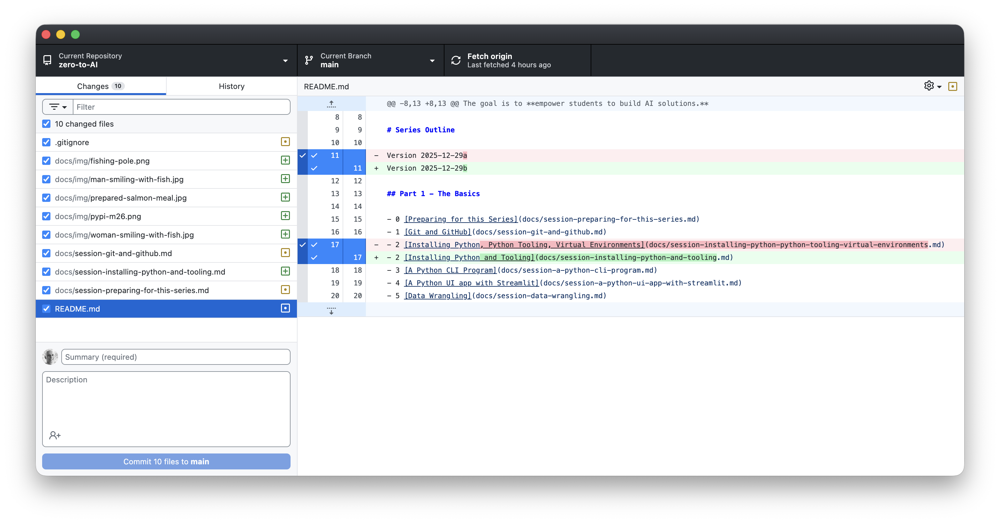

# Part 1, Session 1 - Git and GitHub


## Description

- Git is a distributed and modern Source Control System (DSCM)
- It creates versions of each file, with incremental changes
- Git was created by Linus Torvalds for the development of Linux
- GitHub is a cloud-based PaaS (platform as a service) for Git
- Git can be used locally on your workstation without GitHub
- The .gitignore file - some files/paths shouldn't be stored in git
- Branches - main and features
- Pull Requests (i.e. - PRs) - Peer requests to review and merge feature branch into the main branch

## GitHub Account Creation

 -[Account Creation](https://docs.github.com/en/get-started/start-your-journey/creating-an-account-on-github)
 -[Types of Accounts](https://docs.github.com/en/get-started/learning-about-github/types-of-github-accounts)

```
md| git config setup with email etc
```


## Installation

 -[Download](https://git-scm.com/install/)
 -[macOS Homebrew](https://formulae.brew.sh/formula/git)

## Authentication

- Password and SSH (secure shell protocol)
 -[GitHub Authentication Docs](https://docs.github.com/en/authentication/keeping-your-account-and-data-secure/about-authentication-to-github)

## Demo - Git Command Examples


```
md| pull, branching, push, checkout, ls-files, diff, ls-files, help
```

 -[Git Cheat Sheet](https://git-scm.com/cheat-sheet)

## Demo - GitHub Desktop UI

 -[Installation](https://docs.github.com/en/desktop/installing-and-authenticating-to-github-desktop/installing-github-desktop)

<p align="center">
   
</p>


## Aliases I use

- Added to ~/.bash_profile (macOS) or Windows 11 Profile as functions

```
md| bash shell aliases
```


```
md| win 11 profile functions
```


## References

 -[Linux Torvalds on Wikipedia](https://en.wikipedia.org/wiki/Linus_Torvalds)
