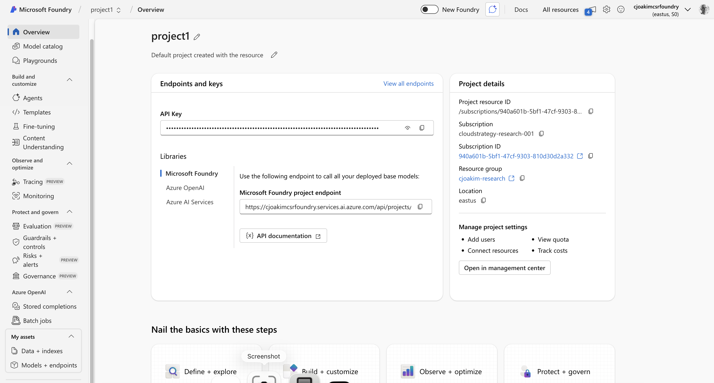
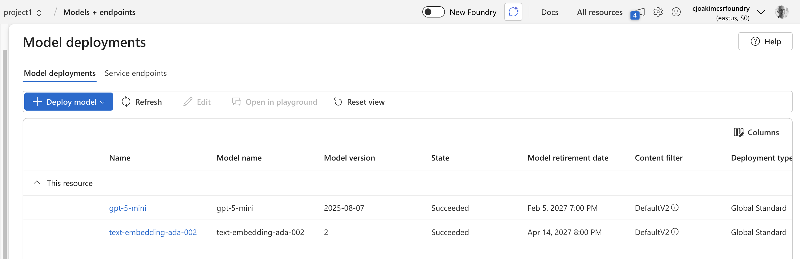
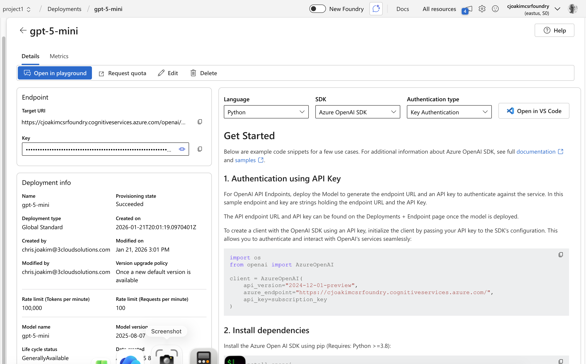
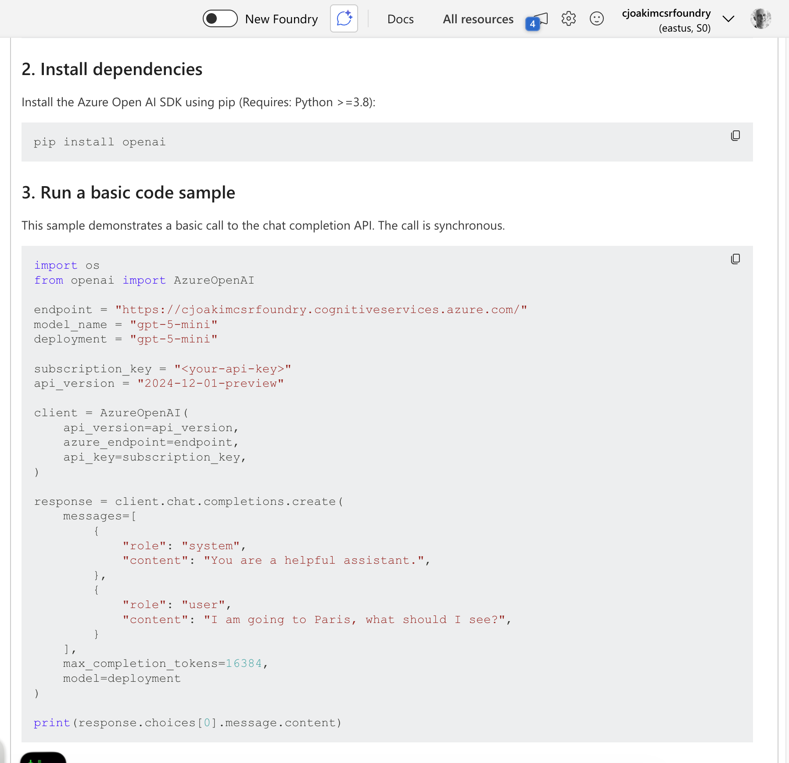

# Part 2, Session 10 - Models, Catalogs, Tokens, Prompts, Foundry 

<br><br>
There's a lot of content in this session!
<br><br>

## What's a AI Model?

- [Microsoft Definition](https://learn.microsoft.com/en-us/azure/ai-foundry/openai/concepts/models)

> An AI model is the engine inside an artificial intelligence system that learns from data
> to perform tasks. It combines algorithms, training data, and learned parameters to transform 
> raw inputs into outputs like recognizing speech, predicting equipment failures,
> or generating new product designs. AI models work at the intersection of artificial intelligence
> and machine learning, where algorithms continually learn from data to deliver 
> more accurate predictions and better responses over time.

### My Definition 

- An AI binary program built for a purpose, but can be quite general purpose
- It's trained (built) on lots and lots of data 
- You can ask it things with a natural-language prompt 
- You can pass the prompt via a SDK call to the model

<br><br><br>
---
<br><br><br>

## What About ML (Machine Learning) Models?

- These are trained for very specific tasks
- Such as recognizing defective parts on a manufacturing line via image recognition
- **AI Models are mostly general purpose, while ML Models are for very specific tasks**
- Companies typically **train** their own ML models 
- While AI models are usually used "off the shelf" as-is
- AI applications can use both AI and ML models, depending on the task
  - But the trend is to use AI models

<br><br><br>
---
<br><br><br>

## Models - Large and Small 

- **Large Language Models (LLMs)** - 
  - Trained on a large or very large or huge corpus of data
  - Runs in the cloud (i.e. - Azure, GCP, AWS, etc.)
  - Requests and responses traverse a network connection
  - Example: The many Azure OpenAI models

- **Small Language Models (SLMs)**
  - Trained on a smaller corpus of data
  - Typically runs locally (i.e. - on your laptop or a device)
  - Requests and responses are local and faster
  - Example: [Ollama](https://ollama.com)
  - Example: [Phi-3 in Azure PostgreSQL](https://azure.microsoft.com/en-us/blog/introducing-phi-3-redefining-whats-possible-with-slms/)

<br><br><br>
---
<br><br><br>

## Primary Dimensions of a Model 

- **Purpose**
  - What use-cases was it built for?
  - Generating natural-language text, or software, or images, or something else
    - Images:  DALL-E, Stable Diffusion, Midjourney, etc
    - Software:  OpenAI Gpt 5, Anthropic Claude 3.5, GPT-5.3-Codex, etc
    - This is called **Generative AI** - generating new content

- **Parameters**
  - Essentially the size of the dataset that was used to train the model
  - Small (e.g., <100M - 1B parameters)
  - Medium (e.g., 1B - 10B parameters)
  - Large (e.g., 10B - 100B+ parameters)

- **Context Window**
  - The maximum amount of context, measured in **tokens**, that can be passed to and from the model
  - Small (e.g., <1000 tokens)
  - Medium (e.g., 1000 - 10000 tokens)
  - Large (e.g., 10000 - 100000+ tokens)

There are many other dimensions of a model, but these are the primary ones

<br><br><br>
---
<br><br><br>

## Model Catalogs

- **There is a large and evolving array of models for different needs**
- Azure Foundry: https://azure.microsoft.com/en-us/products/ai-foundry/models#Models 
- OpenAI Model Catalog: https://ai.azure.com/catalog/publishers/openai 
- Hugging Face Model Catalog: https://huggingface.co/models
- Ollama Model Catalog: https://ollama.com/library

<br><br>

### Personal Opinion: An Analogy to USA Automobile Manufacturers

- In 1930, the industry was new, 44 manufacturers 
  - Packard, Hudson, Nash-Kelvinator, Studebaker, Willys-Overland, Ford, etc 

- In 2026, the industry is mature, and there are very few manufacturers
  - Ford, GM, Tesla

<br><br><br>
---
<br><br><br>

## How do you interact with a Model?

- You (typically) interact with a Model via a **Prompt** and a **SDK** (Software Development Kit)
- A Prompt is a **text-based natural-language request** for the Model to perform a task
  - This is sometimes called **Prompt Engineering** (more of a role or skill than a title)

> Prompt engineering is the practice of designing, refining, and optimizing instructions
> (prompts) to guide large language models (LLMs) and other generative AI to produce
> desired, accurate, and relevant outputs.

### Example Prompt: How did I generage the logo image for the zero-to-AI training series?

```
Create an original logo for the zero-to-AI training series that
evokes Python, Azure, and 3Cloud through color and motif
(inspired by, not copying, their logos).
Put the image into the root of the zero-to-AI directory.
```

<br><br><br>
---
<br><br><br>

### What's the hottest new Programming Language?

**English!** - you use **natural-language** to interact with the Model,
and English is the most widely used natural-language in the world

**Vibe Coding** - writing software mostly with AI prompts, not manual typing

<br><br>

### Demostration: Image generation in Cursor

See **python/prompts/gen-logo-image.txt** in the zero-to-AI repository.

<br><br><br>
---
<br><br><br>

## Tokens 

- **Tokens** are the **fundamental units of text** that AI models use to understand and process language
- A measure of input-output capacity - the **Context Window** of a Model
- A measure of **cost**, too
- https://www.microsoft.com/en-us/microsoft-copilot/for-individuals/do-more-with-ai/general-ai/what-are-ai-tokens/
- The demonstration below should be useful for understanding tokens 

### How can I estimate and measure tokens?

- One token generally corresponds to about 4 characters of text for common English text
  - **1 token ≈ 4 characters**
- 100 tokens is about 75 words of text
- LLMs typically have a LLM-specific "vocabulary" of 30K-100K tokens
- **tiktoken** is a Python library that can help you estimate and measure tokens

<br><br><br>
---
<br><br><br>

### Demonstration: tiktoken with the gpt-4o-mini model

#### The Python Code to executed below


```python
import tiktoken
import sys

...

async def tokens():
    sentence = " ".join(sys.argv[2:])  # get the sentence from the command line arguments
    print("sentence:   {}".format(sentence))
    encoding = tiktoken.encoding_for_model("gpt-4o-mini")
    tokens = encoding.encode(sentence)
    print("tokens:     {}".format(tokens))
    print("num_tokens: {}".format(len(tokens)))
```

```
python main-aoai.py tokens mary had a little lamb
sentence:   mary had a little lamb
tokens:     [123403, 1458, 261, 3389, 50348]
num_tokens: 5


python main-aoai.py tokens mary had a little laptop
sentence:   mary had a little laptop
tokens:     [123403, 1458, 261, 3389, 21851]
num_tokens: 5


python main-aoai.py tokens jean-claude has a laptop
sentence:   jean-claude has a laptop
tokens:     [1587, 270, 12, 16530, 3525, 853, 261, 21851]
num_tokens: 8


python main-aoai.py tokens jean-pierre has a laptop
sentence:   jean-pierre has a laptop
tokens:     [1587, 270, 3161, 26825, 853, 261, 21851]
num_tokens: 7
```

#### Token Observations

- mary = 123403
- lamb = 50348
- laptop = 21851
- little = 3389
- had a little = 1458, 261, 3389
- has a laptop = 853, 261, 21851
- jean-claude = 1587, 270, 12, 16530, 3525
- jean-pierre = 1587, 270, 3161, 26825


#### Final Notes on Tokens

- **Tokens are used to encode content and meaning efficiently in a trained LLM**
  - For example: as integers; laptop = 21851)
- The LLM also understands the **associations** between tokens
  - For example: between 123403 and 50348 (i.e. - mary and lamb)
- We'll talk about the similar concept of **embddings, vectors, and semantic meaning** later in this series


<br><br><br>
---
<br><br><br>

## Azure Foundry 

Azure PaaS service for deploying and managing AI models.

Formerly called Azure AI Foundry.

### Azure Foundry Structure 

- Major Concepts:
  - Workspaces
  - Projects 
  - Model Catalog
  - Model Deployments 
  - Endpoints 

<br><br>

### Screen Shot: A Foundry Project 

In Foundry Portal within Azure Portal

<p align="center">
   
</p>

<br><br>

### Screen Shot: List of Model Deployments

<p align="center">
   
</p>

<br><br>

### Screen Shot: Model Deployment Details

<p align="center">
   
</p>

<br><br>

### Screen Shot: Sample Python Code in Foundry UI

They provide a quick-start sample.

<p align="center">
   
</p>

<br><br><br>

## Next Session: Using the Azure OpenAI SDK

We'll use the LLM models described here today.

<br><br><br>
---
<br><br><br>

[Home](../README.md)

